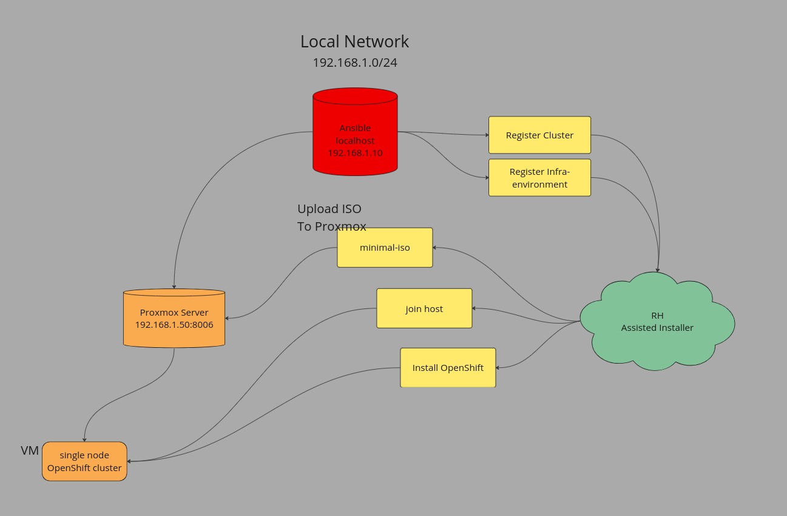

# Single Node OpenShift | Assisted Installer

## Description

Ansible automation that will stand up a single node OpenShift cluster on your local proxmox node using the assisted installer API [Red Hat Assisted Installer](https://access.redhat.com/documentation/en-us/assisted_installer_for_openshift_container_platform/2022/html/assisted_installer_for_openshift_container_platform/installing-with-api#doc-wrapper). 

After running this automation successfully you should have a local OpenShift cluster running in your proxmox environment.

## Dependancies
- `python3.10+` is installed on your system

- `ansible` is installed on your system
    - for Debian distros (ex. Ubuntu) run the following command
        - `sudo apt install ansible` 
    - for RedHat distros (ex RHEL/Fedora) run the following command
        - `sudo dnf install ansible`


## Requirements

- You have downloaded your pull-secret and saved it to it's own file.
    - make sure to update the `assisted_installer_credentials` variable fields to reflect the path/location

- You have dowloaded your token and saved it to it's own file. 
    - make sure to update the `assisted_installer_credentials` variable fields to reflect the path/location

- Reviewed the following variables in the `vars.yml` file.
    - vmname
    - vmid
    - base_dns_domain
    - local_user
    - local_group
    - assisted_installer_credentials
    - storage_size_gb (used in cluster_resources)
    - cluster_resources
        - memory.size_mb
        - cpu.cores
    - proxmox
    - isos.path


## How It Works

At high level this automation will run on a machine that is located on the same network as your proxmox environment. The automation will use your `pull-secret.txt` and `token.txt` file to communicate with the Red Hat Assisted Installer to register and create a new single node OpenShift cluster. 

This automation does assume a bit of a distructive nature when going about creating the cluster. Whatever the vmid you specify in the `vars.yml` will overwrite any existing vm configuration you had with that vmid. Also any clusters in the assisted installer with the same name specified in `vars.yml` will be deleted/archived, ensuring the uniqueness of cluster names (and a tidy UI after reruns).

Here is an example flow diagram of how the automation interacts with the proxmox api and assisted istaller api



## How To Use

Use this command to kick-off the automation

```
ansible-playbook deploy-cluster
```

The automation will prompt you for two response 

1. The sudo password for your `local_user` defined in `vars.yml`

2. The root password for your proxmox environment


